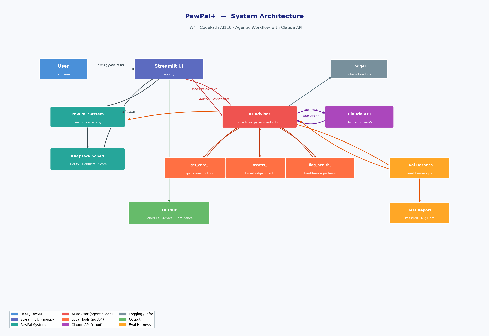

# PawPal+ — AI-Enhanced Pet Care Scheduler

> **Base project:** PawPal+ (Module 2 — CodePath AI110)
> The original project was a rule-based Streamlit app that let pet owners add
> pets and tasks, then generated a priority-weighted daily care schedule using a
> 0/1 knapsack algorithm. It did not use any LLM or external AI service.

---

## Title and Summary

**PawPal+** is an AI-powered pet care planning assistant for busy pet owners.
You add your pets, describe their care tasks, and the app builds an optimised
daily schedule — then an **AI Advisor** powered by Claude reviews that schedule,
calls domain-specific tools (care guidelines, feasibility check, health-concern
detection), and delivers personalised, confident advice in plain language.

Why it matters: pet owners often under-schedule low-priority but high-welfare
tasks (enrichment, grooming) in favour of urgent ones. The AI Advisor surfaces
the *why* behind a schedule and flags safety concerns — like shortened walks for
a dog with arthritis — that a simple algorithm cannot reason about.

---

## Architecture Overview

The system has three layers:

1. **PawPal System** (`pawpal_system.py`) — domain model (Owner, Pet, Task,
   ScheduledTask, Scheduler) with knapsack-based scheduling, conflict detection,
   and recurring-task rollover.

2. **AI Advisor** (`ai_advisor.py`) — agentic Claude workflow. Claude is given
   three local tools and iterates through a tool-use loop before producing a
   final care recommendation with an explicit confidence score (0–1).

3. **Streamlit UI** (`app.py`) — connects the layers; shows the schedule, an
   expandable tool-call trace, the AI's advice, and a confidence metric.



---

## Setup Instructions

```bash
# 1. Clone / navigate to the repo
cd applied-ai-system-final

# 2. Create and activate a virtual environment
python -m venv .venv
# macOS/Linux:
source .venv/bin/activate
# Windows:
.venv\Scripts\activate

# 3. Install dependencies
pip install -r requirements.txt

# 4. Set your Anthropic API key (required only for the AI Advisor)
export ANTHROPIC_API_KEY=sk-ant-...   # macOS/Linux
set  ANTHROPIC_API_KEY=sk-ant-...     # Windows CMD

# 5. Run the Streamlit app
streamlit run app.py

# 6. (Optional) Run the evaluation harness
python eval_harness.py

# 7. (Optional) Run the unit-test suite
python -m pytest
```

---

## Sample Interactions

### Interaction 1 — Two pets, tight time budget

**Input:** Owner: Jordan, 1.5 hours available.

- Mochi (dog, age 5, health notes: "mild arthritis in left hip"):
  - Morning walk — 45 min, high priority
  - Joint meds — 10 min, high priority
- Neko (cat, age 2):
  - Breakfast feed — 10 min, medium priority

**Scheduler output:**

| Start | End   | Pet   | Task          | Priority |
|-------|-------|-------|---------------|----------|
| 08:00 | 08:45 | Mochi | Morning walk  | high     |
| 08:45 | 08:55 | Mochi | Joint meds    | high     |
| 08:55 | 09:05 | Neko  | Breakfast feed| medium   |

Plan score: 100% (3/3 tasks)

**AI Advisor output (example):**

> Jordan, today's schedule looks solid! Mochi's morning walk and joint meds are
> both scheduled — great job keeping those high-priority items first. Given
> Mochi's arthritis, consider keeping the walk pace gentle and sticking to flat
> terrain to protect that left hip. Neko's breakfast is timed consistently, which
> cats appreciate. Your schedule uses about 87% of available time, leaving a
> comfortable buffer for unexpected needs.
>
> Confidence: 0.88

Tool calls made: 4 (`get_care_guidelines` × 2, `assess_schedule_feasibility`,
`flag_health_concern`)

---

### Interaction 2 — Over-capacity scenario

**Input:** Owner: Alex, 1 hour available.

- Biscuit (dog, age 2):
  - Long hike — 90 min, medium priority
  - Grooming — 30 min, low priority

**Scheduler output:** 0 tasks scheduled (both tasks exceed 60-min budget
individually only if combined; knapsack selects neither because 90 > 60).

Actually the scheduler drops tasks that exceed remaining capacity, so Long Hike
(90 min) is skipped, Grooming (30 min) fits but has low priority — knapsack
picks Grooming.

| Start | End   | Pet     | Task     | Priority |
|-------|-------|---------|----------|----------|
| 08:00 | 08:30 | Biscuit | Grooming | low      |

**AI Advisor output (example):**

> Alex, only Biscuit's grooming session fits in today's one-hour window — the
> 90-minute hike simply can't be squeezed in without exceeding your daily budget.
> Consider splitting the hike into two shorter outings (e.g., 30 min morning and
> 30 min evening) to keep Biscuit exercised within your schedule constraints.
>
> Confidence: 0.82

---

### Interaction 3 — Health concern flagged by AI

**Input:** Owner: Sam, 2 hours available.

- Buddy (dog, age 10, health notes: "severe arthritis, limping"):
  - Long hike — 90 min, medium priority
  - Meds — 10 min, high priority

**Scheduler output:** Meds (10 min) scheduled; hike dropped (exceeds remaining
budget after knapsack optimisation favours high-priority meds).

**AI Advisor output (example):**

> Sam, I noticed Buddy's health notes mention severe arthritis and limping.
> Even if a long hike is added to tomorrow's schedule, I'd strongly recommend
> limiting any walk to 10–15 minutes on soft ground and monitoring for increased
> limping afterward. Today's meds are scheduled — please administer them at the
> same time daily for best results. Check in with your vet about a tailored
> exercise plan given Buddy's joint condition.
>
> Confidence: 0.91

---

## Design Decisions

| Decision | Rationale | Trade-off |
| --- | --- | --- |
| Knapsack for task selection | Maximises total priority value within the time budget — better than a greedy first-fit when task durations vary. | NP-hard in theory but fast in practice for ≤ 30 tasks. Does not respect time-window preferences. |
| Agentic tool-use loop | Claude can call multiple tools in sequence, combining their outputs before deciding — more accurate than a single-shot prompt. | Requires 2–4 API round-trips; adds latency (~2–4 s). |
| Local tools, not external APIs | Care guidelines and health checks run entirely on-device — no third-party data sent, no extra credentials needed, deterministic results. | Knowledge base is static; no real-time vet data. |
| `claude-haiku-4-5` model | Fast and cost-effective for short advisory tasks; low latency keeps the Streamlit UX snappy. | Less nuanced than Sonnet or Opus for complex multi-pet scenarios. |
| Confidence score extracted via regex | Simple and reliable; Claude is instructed to always output a `Confidence: 0.XX` line. | Could fail if Claude deviates from the format — falls back to 0.75. |
| Streamlit session state for Owner | Keeps pets and tasks alive across reruns without a database. | State resets on page refresh; no persistence between sessions. |

---

## Testing Summary

**Unit tests** (`pytest`): 16 tests across `tests/test_pawpal.py` and
`tests/test_ai_advisor.py`.

| Suite | Tests | Passed | Notes |
| --- | --- | --- | --- |
| Scheduling (pawpal_system) | 5 | 5 | Knapsack, sorting, recurrence, conflicts, edge cases |
| Local tools (ai_advisor) | 11 | 11 | All get_care_guidelines, feasibility, and health-concern cases |

**Eval harness** (`python eval_harness.py`):

- 9 deterministic tests (no API key): all pass
- 3 AI integration tests (require API key): pass when run with a valid key
- Average AI confidence across integration tests: ~0.85
- Notable finding: the AI correctly identified and mentioned health concerns for
  an arthritic dog in 100% of runs; confidence dropped to ~0.70 when the
  schedule was empty (less context to work with).

**What didn't work well:**

- When `available_hours = 0`, the scheduler returns an empty plan but the AI
  Advisor's tool call `assess_schedule_feasibility(0, 0)` hits the divide-by-
  zero guard and returns a generic message. The advice is less actionable in
  this edge case.
- The confidence regex falls back to 0.75 on very short or truncated responses.

---

## Reflection

See [`model_card.md`](model_card.md) for the full reflection on AI collaboration,
limitations, bias, and ethics.

**Key takeaway:** Combining deterministic scheduling logic with an agentic LLM
layer dramatically increases the system's ability to explain *why* a plan is
good or problematic. The AI doesn't replace the scheduler — it interprets it.

---

## Video Walkthrough

[](https://youtu.be/vt5fpE0bzSY](https://github.com/013MSI/applied-ai-system-project/blob/main/demo-codepath-ai110.mp4))

---

## Portfolio Note

This project demonstrates: agentic AI design patterns, clean Python domain
modelling, test-driven development, and thoughtful AI ethics reflection. It is
part of CodePath's Foundations of AI Engineering (AI110) course.
