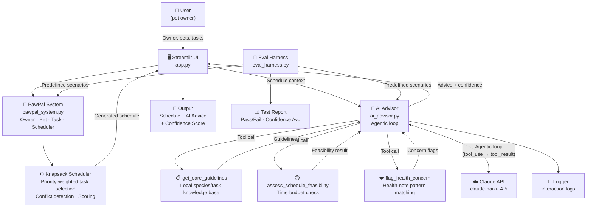

# System Architecture — PawPal+ Enhanced

Paste the Mermaid source below into https://mermaid.live, click **Export → PNG**,
save the file as `assets/architecture.png`, and embed it in the README.

```mermaid
flowchart TD
    U["👤 User\n(pet owner)"]
    UI["🖥️ Streamlit UI\napp.py"]
    PS["🐾 PawPal System\npawpal_system.py\nOwner · Pet · Task · Scheduler"]
    KS["⚙️ Knapsack Scheduler\nPriority-weighted task selection\nConflict detection · Scoring"]
    AI["🤖 AI Advisor\nai_advisor.py\nAgentic loop"]
    T1["📋 get_care_guidelines\nLocal species/task knowledge base"]
    T2["⏱️ assess_schedule_feasibility\nTime-budget check"]
    T3["❤️ flag_health_concern\nHealth-note pattern matching"]
    CL["☁️ Claude API\nclaude-haiku-4-5"]
    LOG["📝 Logger\ninteraction logs"]
    OUT["📅 Output\nSchedule + AI Advice\n+ Confidence Score"]
    EH["🧪 Eval Harness\neval_harness.py"]
    RPT["📊 Test Report\nPass/Fail · Confidence Avg"]

    U -->|"Owner, pets, tasks"| UI
    UI --> PS
    PS --> KS
    KS -->|"Generated schedule"| UI
    UI -->|"Schedule context"| AI

    AI -->|"Tool call"| T1
    AI -->|"Tool call"| T2
    AI -->|"Tool call"| T3
    T1 -->|"Guidelines"| AI
    T2 -->|"Feasibility result"| AI
    T3 -->|"Concern flags"| AI

    AI <-->|"Agentic loop\n(tool_use → tool_result)"| CL
    AI --> LOG
    AI -->|"Advice + confidence"| UI
    UI --> OUT

    EH -->|"Predefined scenarios"| PS
    EH -->|"Predefined scenarios"| AI
    EH --> RPT
```
